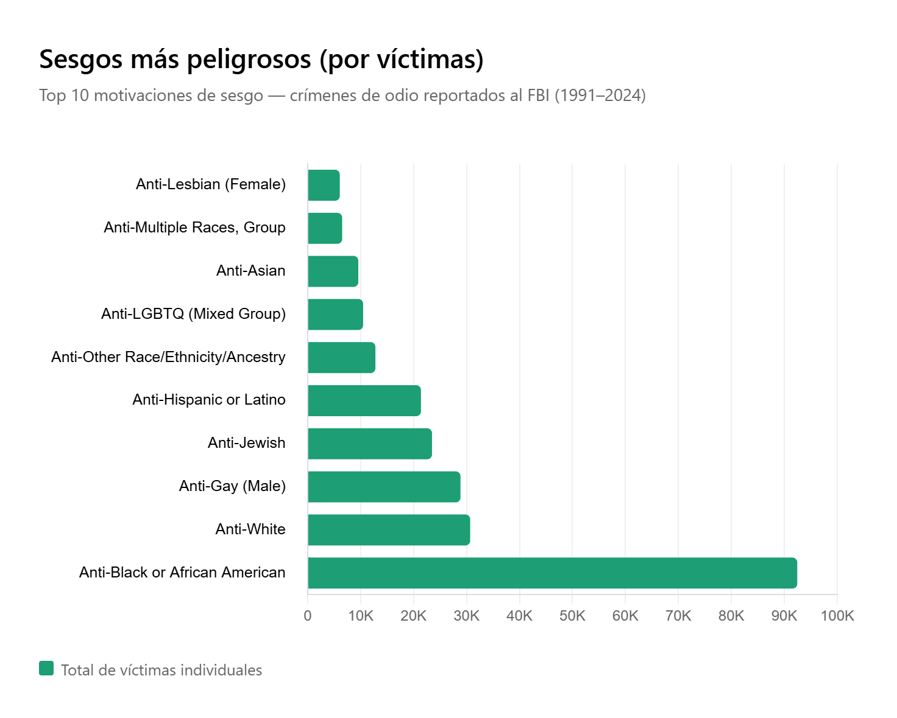
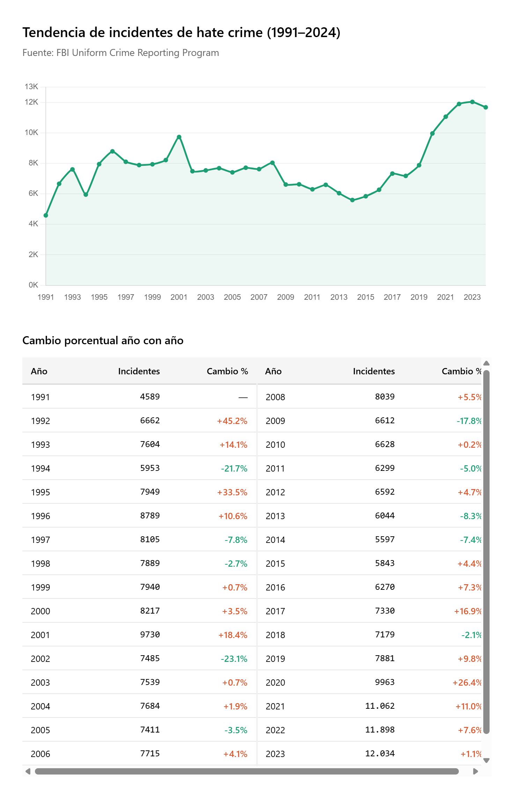
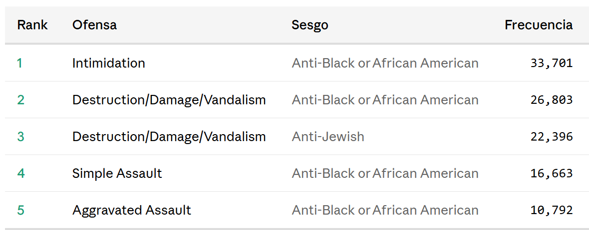
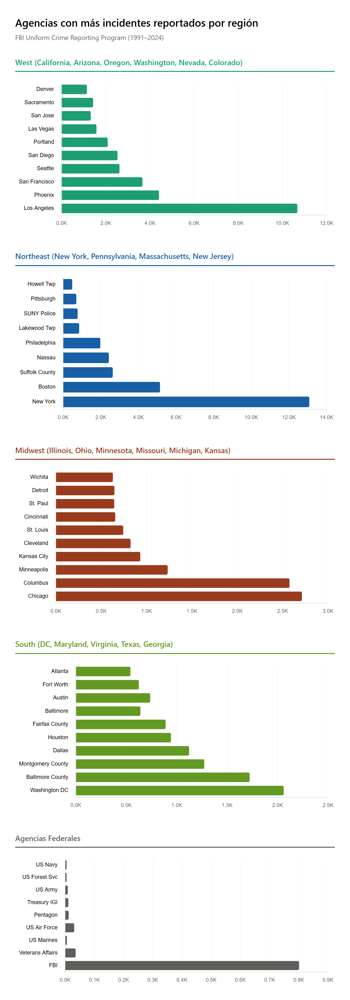
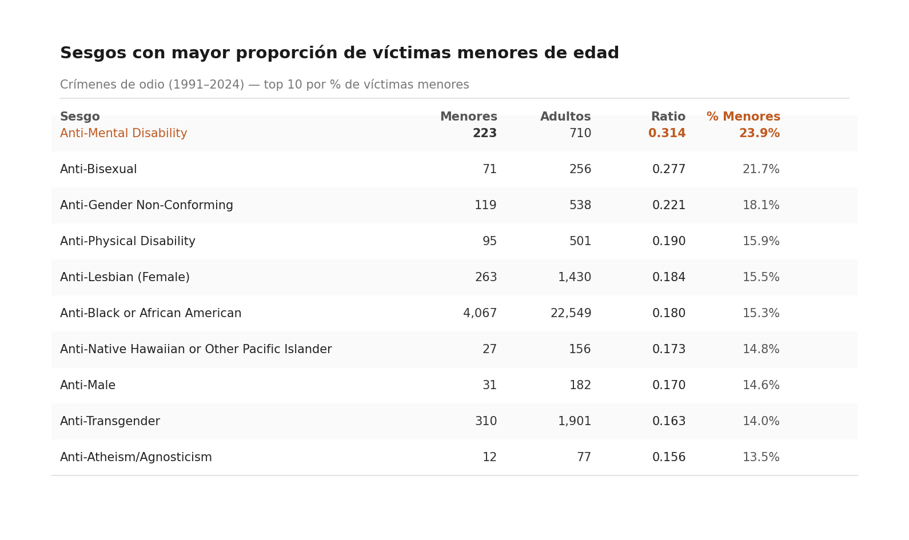
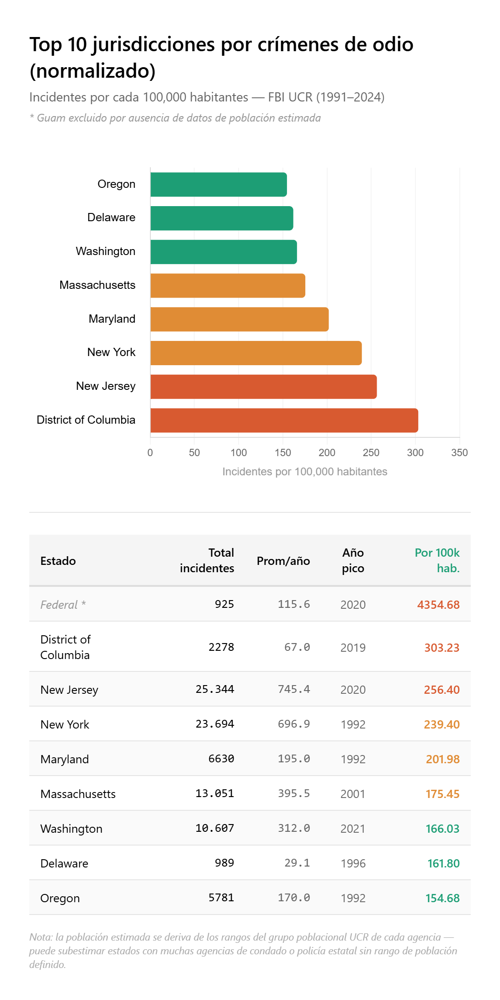

# Proyecto Final — Bases de Datos

**Curso:** COM-12101-001 · Bases de Datos · Primavera 2026  
**Dataset:** FBI Hate Crime Statistics (Crime Data Explorer)  
**Equipo:** Valentina García Ramírez | Aniel Orihuela | Diego Manrique | Diego Hinojosa  
**Profesor:** Marco Augusto Vásquez Beltran.  
**Se hizo uso de Claude AI para la organización, limpieza y para cualquier gráfico o tabla que se encuentra en este Readme.md**

---

## 1. Enlaces directos al conjunto de datos

- **Portal principal (CDE — Crime Data Explorer):** https://cde.ucr.cjis.gov/
- **Sección de descargas (Documents & Downloads):** https://cde.ucr.cjis.gov/LATEST/webapp/#/pages/downloads
- **Archivo usado:** `hate_crime.csv` dentro del paquete comprimido *"Hate Crime"* listado en **Additional Datasets**.
- **Página explicativa del programa:** https://www.fbi.gov/how-we-can-help-you/more-fbi-services-and-information/ucr/hate-crime
- **Publicación anual más reciente (prensa):** https://www.fbi.gov/news/press-releases/fbi-releases-2023-hate-crime-statistics
- **Libro de referencia académica sobre la estructura del dato:** *Decoding FBI Crime Data*, cap. 9 — https://ucrbook.com/hate_crimes.html
- **Código fuente del frontend del CDE (referencia técnica):** https://github.com/fbi-cde/crime-data-frontend

---

## 2. Descripción del conjunto de datos

### 2.1 Resumen

`hate_crime.csv` contiene un registro por **incidente** de crimen de odio reportado a la División de Servicios de Información de Justicia Criminal del FBI (CJIS) a través del programa **Uniform Crime Reporting (UCR)**. Cada fila describe un incidente ocurrido en un lugar y fecha específicos, reportado por una agencia de orden público de EE. UU., e incluye información sobre:

- La **agencia** reportante (identificador ORI, nombre, tipo, estado, región, grupo poblacional).
- El **incidente** (fecha, identificador, cuenta de víctimas y ofensores, indicadores de sesgo múltiple u ofensa múltiple).
- Las **ofensas** cometidas (una o varias, separadas por `;` dentro de la celda `OFFENSE_NAME`).
- Las **motivaciones de sesgo** (una o varias, separadas por `;` en `BIAS_DESC`; p. ej. *Anti-Black or African American*, *Anti-Jewish*, *Anti-Gay (Male)*).
- Los **tipos de víctima** (individuo, negocio, institución religiosa, sociedad, etc.).
- La **demografía del ofensor** (raza, etnicidad, conteos de adultos y menores).
- El **tipo de ubicación** donde ocurrió el hecho (residencia, vía pública, escuela, casa de culto, etc.).

### 2.2 Origen y autoría

Los datos son recolectados por la **Federal Bureau of Investigation (FBI)**, específicamente por la *Criminal Justice Information Services Division (CJIS)*, dentro del programa **Uniform Crime Reporting (UCR)**. El reporte es nutrido por más de 18,000 agencias locales, estatales, tribales, federales y universitarias de orden público que envían información voluntariamente al FBI, ya sea mediante el esquema **SRS** (Summary Reporting System, usado históricamente) o el esquema **NIBRS** (National Incident-Based Reporting System, el estándar vigente desde 2021).

El programa UCR opera desde 1930. La recolección sistemática de crímenes de odio comenzó en **1991** como resultado del *Hate Crime Statistics Act* de 1990, que obligó al Procurador General a recopilar estadísticas sobre crímenes motivados por prejuicio.

### 2.3 Justificación

La recolección responde a un mandato legal federal (*Hate Crime Statistics Act*, 1990, y sus reformas posteriores: inclusión del sesgo anti-discapacidad en 1994, anti-gender identity y anti-gender en 2013, anti-árabe como categoría separada en 2015, etc.). El objetivo declarado del programa es:

1. **Cuantificar** la incidencia y naturaleza de crímenes motivados por prejuicio racial, religioso, étnico, de orientación sexual, identidad de género, discapacidad o género, para informar políticas públicas.
2. **Apoyar investigaciones** federales, estatales y locales.
3. **Producir transparencia** frente a víctimas, organizaciones civiles y medios de comunicación.
4. **Retroalimentar** programas de prevención y capacitación policial.

### 2.4 Disponibilidad y acceso

- **Fuente canónica:** FBI Crime Data Explorer — https://cde.ucr.cjis.gov/
- **Licencia:** Dominio público (obra del gobierno federal estadounidense; *Title 17 U.S.C. § 105*). Libre para usar, redistribuir y transformar, con la recomendación explícita de citar al FBI UCR como origen.
- **Formato:** CSV dentro de un archivo comprimido (`.zip`).
- **Costo:** Gratuito.
- **Registro requerido:** No.

### 2.5 Periodicidad de actualización

**Anual.** El FBI publica una nueva entrega alrededor del tercer o cuarto trimestre del año siguiente al reportado (por ejemplo, los datos completos de 2023 se publicaron en el otoño de 2024). En ocasiones emite **suplementos** a mitad de año cuando agencias tardías completan sus envíos. La revisión 2024 ampliada está prevista para finales de 2025 / inicios de 2026.

### 2.6 Dimensiones

- **Alcance temporal seleccionado por el equipo:** 1991 – último año disponible.
- **Volumen aproximado de registros:** ≈ **250,000 incidentes** acumulados de 1991 a 2023 (el número crece con cada entrega anual; un año típico reciente aporta entre 8,000 y 12,000 incidentes).
- **Número de atributos:** **28 columnas** en el archivo desnormalizado.
- **Cumplimiento de la rúbrica:**

  | Requisito de la rúbrica | Mínimo | Este dataset | ¿Cumple? |
  |---|---|---|---|
  | Registros | 5,000 | ≈ 250,000 | Sí |
  | Atributos | 15 | 28 | Sí |
  | Entidades identificables | 5 | ≥ 7 (Agencia, Ubicación geopolítica, Incidente, Ofensa, Sesgo/Bias, TipoDeVíctima, PerfilDeOfensor) | Sí |
  | Estado | No normalizado | Sí — contiene columnas multivaluadas separadas por `;`, redundancia jerárquica (estado/región/división) y repetición de descripciones de agencia por incidente | Sí |
  | Datos públicos y reales | Sí | Sí (FBI CDE, dominio público) | Sí |

### 2.7 Justificación del alcance temporal

Se recomienda cargar el archivo histórico completo (1991 hasta el año más reciente disponible) por tres razones:

1. **Volumen manejable.** ~250k filas × 28 columnas ≈ 60 MB en CSV y < 200 MB una vez cargado en PostgreSQL; Render (PostgreSQL gratuito con 1 GB de almacenamiento) lo soporta sin problema.

2. **Riqueza analítica.** Permite responder preguntas de series temporales, comparar evolución de categorías de sesgo (varias se introdujeron en 2013 y 2015) y evaluar la transición SRS → NIBRS (2021).

3. **Aporta al paso 3 (normalización).** El rango histórico hace evidentes las dependencias funcionales (p. ej. `ORI → STATE_NAME → REGION_NAME`) y las multivaluadas (`INCIDENT_ID →→ BIAS_DESC`), insumo directo para 4NF.

**Advertencia documental importante** (se menciona en 2.13): los registros previos a 2013 no contienen las categorías de sesgo por identidad de género ni género, y los de 2021–2022 presentan cobertura reducida por la transición a NIBRS-only. Esto debe contemplarse al hacer comparaciones longitudinales.

---

## 3. Diccionario de datos

Las 28 columnas del archivo desnormalizado, en el orden en que aparecen en el CSV. El tipo propuesto es el que se usará en las tablas de *staging* en PostgreSQL; los valores finales podrán ajustarse tras el análisis exploratorio (paso 2).

| # | Columna | Tipo SQL (staging) | Naturaleza | Descripción | Ejemplo | Notas de calidad |
|---|---|---|---|---|---|---|
| 1 | `INCIDENT_ID` | `BIGINT` | Cuantitativa (identificador) | Identificador único del incidente asignado por el FBI. | `1` | Clave candidata. |
| 2 | `DATA_YEAR` | `SMALLINT` | Cuantitativa (discreta) / serie temporal | Año del reporte UCR. | `2023` | Rango 1991 – último año disponible. |
| 3 | `ORI` | `CHAR(9)` | Cualitativa (identificador) | *Originating Agency Identifier*: código único de 9 posiciones de la agencia (letras del estado + 7 dígitos). | `CA0194200` | Clave foránea a la entidad Agencia. |
| 4 | `PUB_AGENCY_NAME` | `VARCHAR(120)` | Cualitativa (texto corto) | Nombre público de la agencia reportante. | `Los Angeles` | Dependiente funcional de `ORI`. |
| 5 | `PUB_AGENCY_UNIT` | `VARCHAR(120)` | Cualitativa (texto corto) | Unidad o sub-agencia reportante (mayormente nula). | `Transit` | Alta proporción de nulos (>90 %). |
| 6 | `AGENCY_TYPE_NAME` | `VARCHAR(60)` | Cualitativa (categórica) | Tipo de agencia. | `City`, `County`, `University or College`, `State Police` | Categórica con ~10 valores. |
| 7 | `STATE_ABBR` | `CHAR(2)` | Cualitativa (categórica) | Abreviatura de estado (ISO-style USPS). | `CA`, `TX`, `NY` | Dependiente funcional de `ORI`. |
| 8 | `STATE_NAME` | `VARCHAR(40)` | Cualitativa (categórica) | Nombre completo del estado. | `California` | Redundante respecto a `STATE_ABBR`. |
| 9 | `DIVISION_NAME` | `VARCHAR(40)` | Cualitativa (categórica) | División del Census Bureau. | `Pacific`, `Mountain`, `South Atlantic` | 9 valores. Dependiente funcional de `STATE_ABBR`. |
| 10 | `REGION_NAME` | `VARCHAR(20)` | Cualitativa (categórica) | Región del Census Bureau. | `West`, `South`, `Northeast`, `Midwest` | 4 valores. Dependiente funcional de `DIVISION_NAME`. |
| 11 | `POPULATION_GROUP_CODE` | `VARCHAR(4)` | Cualitativa (categórica) | Código de grupo poblacional UCR. | `1A`, `2`, `9` | ~12 valores. |
| 12 | `POPULATION_GROUP_DESC` | `VARCHAR(120)` | Cualitativa (categórica) | Descripción del grupo poblacional (p. ej. tamaño de ciudad). | `Cities 250,000 thru 499,999` | Dependiente funcional de `POPULATION_GROUP_CODE`. |
| 13 | `INCIDENT_DATE` | `DATE` | Serie temporal | Fecha del incidente (formato `DD-MON-YY`). | `15-JUN-23` | Requiere parseo explícito durante la carga. |
| 14 | `ADULT_VICTIM_COUNT` | `SMALLINT` | Cuantitativa (discreta) | Número de víctimas adultas (≥ 18 años). | `2` | Puede ser nulo. |
| 15 | `JUVENILE_VICTIM_COUNT` | `SMALLINT` | Cuantitativa (discreta) | Número de víctimas menores de 18. | `0` | Puede ser nulo. |
| 16 | `TOTAL_OFFENDER_COUNT` | `SMALLINT` | Cuantitativa (discreta) | Total de ofensores conocidos. `0` indica ofensor desconocido. | `1` | |
| 17 | `ADULT_OFFENDER_COUNT` | `SMALLINT` | Cuantitativa (discreta) | Ofensores adultos. | `1` | Puede ser nulo. |
| 18 | `JUVENILE_OFFENDER_COUNT` | `SMALLINT` | Cuantitativa (discreta) | Ofensores menores de 18. | `0` | Puede ser nulo. |
| 19 | `OFFENDER_RACE` | `VARCHAR(60)` | Cualitativa (categórica) | Raza del ofensor (o raza predominante). | `White`, `Black or African American`, `Unknown`, `Asian` | Incluye `Unknown` y `Not Specified`. |
| 20 | `OFFENDER_ETHNICITY` | `VARCHAR(60)` | Cualitativa (categórica) | Etnicidad del ofensor. | `Hispanic or Latino`, `Not Hispanic or Latino`, `Unknown`, `Multiple` | Muy alta proporción de `Unknown`. |
| 21 | `VICTIM_COUNT` | `SMALLINT` | Cuantitativa (discreta) | Número total de víctimas del incidente (individuos + entidades). | `1` | |
| 22 | `OFFENSE_NAME` | `VARCHAR(500)` | Cualitativa (multivaluada) / texto semiestructurado | Nombre(s) de la(s) ofensa(s) NIBRS / SRS. Multivaluada: varios valores separados por `;`. | `Intimidation;Simple Assault` | Requiere *split* a tabla hija (4NF). |
| 23 | `TOTAL_INDIVIDUAL_VICTIMS` | `SMALLINT` | Cuantitativa (discreta) | Víctimas individuales (personas físicas) involucradas. | `1` | Puede diferir de `VICTIM_COUNT` cuando hay víctimas tipo *Business* o *Society*. |
| 24 | `LOCATION_NAME` | `VARCHAR(200)` | Cualitativa (multivaluada) | Tipo(s) de ubicación NIBRS. Multivaluada con `;`. | `Residence/Home`, `School - Elementary/Secondary;Parking Lot/Drop Lot/Garage` | 46 tipos posibles en NIBRS. |
| 25 | `BIAS_DESC` | `VARCHAR(500)` | Cualitativa (multivaluada) | Motivación(es) de sesgo. Multivaluada con `;`. | `Anti-Black or African American`, `Anti-Jewish;Anti-Arab` | Categorías nuevas en 2013 y 2015. |
| 26 | `VICTIM_TYPES` | `VARCHAR(200)` | Cualitativa (multivaluada) | Tipo(s) de víctima (Individual, Business, Society, Government, etc.). Multivaluada con `;`. | `Individual`, `Religious Organization;Individual` | |
| 27 | `MULTIPLE_OFFENSE` | `CHAR(1)` | Cualitativa (booleana) | `S` = Single offense, `M` = Multiple offenses. | `S` | Derivable de `OFFENSE_NAME`. |
| 28 | `MULTIPLE_BIAS` | `CHAR(1)` | Cualitativa (booleana) | `S` = Single bias, `M` = Multiple biases. | `S` | Derivable de `BIAS_DESC`. |

### 3.1 Clasificación rápida de variables

**Cuantitativas (numéricas):** `INCIDENT_ID`, `DATA_YEAR`, `ADULT_VICTIM_COUNT`, `JUVENILE_VICTIM_COUNT`, `TOTAL_OFFENDER_COUNT`, `ADULT_OFFENDER_COUNT`, `JUVENILE_OFFENDER_COUNT`, `VICTIM_COUNT`, `TOTAL_INDIVIDUAL_VICTIMS`.

**Cualitativas (categóricas):** `ORI`, `PUB_AGENCY_NAME`, `PUB_AGENCY_UNIT`, `AGENCY_TYPE_NAME`, `STATE_ABBR`, `STATE_NAME`, `DIVISION_NAME`, `REGION_NAME`, `POPULATION_GROUP_CODE`, `POPULATION_GROUP_DESC`, `OFFENDER_RACE`, `OFFENDER_ETHNICITY`, `MULTIPLE_OFFENSE`, `MULTIPLE_BIAS`.

**Multivaluadas (texto semi-estructurado con separador `;`):** `OFFENSE_NAME`, `LOCATION_NAME`, `BIAS_DESC`, `VICTIM_TYPES`. Son el insumo clave para justificar la descomposición hasta **4NF** en el paso 3.

**Series temporales:** `INCIDENT_DATE` (fecha), `DATA_YEAR` (año). No hay timestamps a nivel de hora.

**Texto no estructurado:** estrictamente hablando no hay campos de texto libre tipo *narrative*. Los campos de 500 caracteres (`OFFENSE_NAME`, `BIAS_DESC`) son semi-estructurados: son listas de categorías controladas unidas por `;`. El campo `PUB_AGENCY_NAME` contiene nombres propios con variabilidad ortográfica histórica (ayuntamientos que cambian de nombre, fusiones), y es el único candidato a tratamiento tipo texto libre.

---

## 4. Visión estratégica

### 4.1 Objetivo principal del proyecto

**Construir una base de datos relacional normalizada a 4NF que permita analizar la evolución, distribución geográfica y composición demográfica de los crímenes de odio reportados al FBI entre 1991 y la entrega más reciente, para identificar patrones accionables de política pública.**

### 4.2 Preguntas analíticas que el diseño deberá poder responder

Se expondrán más a detalle en la sección 7, pero las preguntas que queremos poder responder son:
1. ¿Cuál sesgo causa más daño (más víctimas)?
2. ¿Está aumentando o disminuyendo el número de crímenes?
3. ¿Qué tipos de crímenes van asociados a qué sesgos?
4. ¿Qué agencias reportan más incidentes comparadas con otras de su región?
5. ¿Hay sesgos que atacan más a menores de edad?
6. ¿Cuál estado es "hotspot" de crímenes de odio?

### 4.3 Métodos y recursos

Para asegurarnos que se podrá tener acceso sin problema a las APIs y a la base de datos en general, optamos por usar render. La base de datos es manipulada localmente desde DBeaver(PostgresSQL), pero render permite guardarla en la nube. 

Se hizo uso igualmente de FastAPI, Pydantic BaseModel, Base y SQLAlchemy para lograr la interacción entre el cliente y el servidor.

---
## 5. Consideraciones éticas

### 5.1 Sesgos y limitaciones conocidos de la fuente

- **Sub-reporte estructural.** Estudios del Bureau of Justice Statistics estiman que los crímenes de odio reales podrían ser **varias veces** mayores a los reportados al FBI (véase la *National Crime Victimization Survey*). Ninguna cifra del dataset debe interpretarse como "total de crímenes de odio ocurridos", solo como "total de crímenes *reportados al UCR*".
- **Participación voluntaria de agencias.** No todas las agencias participan ni lo hacen con la misma periodicidad. Estados y ciudades completas pueden ausentarse durante años. Comparaciones transversales requieren controlar por cobertura.
- **Transición SRS → NIBRS.** En 2021 el FBI retiró el SRS. Varias agencias grandes (incluidas NYPD y LAPD por periodos) tuvieron gaps durante la transición. **Los años 2021 y 2022 muestran caídas artificiales de volumen** que no representan una reducción real de incidentes.
- **Categorías no estables en el tiempo.** El *Matthew Shepard and James Byrd Jr. Act* (2009) expandió las categorías a partir de 2013. El sesgo anti-árabe se separó como categoría independiente en 2015. Los sesgos por género e identidad de género comenzaron a capturarse en 2013. Comparar series largas exige agrupar o filtrar con cuidado.
- **Clasificación del sesgo depende de la policía que reporta.** Dos agencias distintas pueden clasificar el mismo hecho de forma distinta. Hay un sesgo humano en la asignación del `BIAS_DESC`.

---

## 6. Normalización del esquema

### 6.1 Análisis inicial: identificación de entidades

Al analizar las 28 columnas del CSV desnormalizado, identificamos jerarquías y agrupaciones naturales:

**Subunidades detectadas:**
- Agencia → unidad (ej: LAPD → Transit Division)
- Región → estado → división

Para simplificar las búsquedas avanzadas, nos limitamos a: agencia general, región y estado (sin incluir unidad ni división).

**Entidades más obvias identificadas:**
- `agencia`
- `region`
- `estado`
- `incidente`

### 6.2 Problema 1NF: columnas multivaluadas

La columna `offense_name` contiene múltiples valores separados por `;` (ejemplo: `"Intimidation;Simple Assault"`), lo que viola **Primera Forma Normal (1NF)**.

**Otras columnas multivaluadas detectadas:**
- `bias_desc` (sesgos): `"Anti-Black or African American;Anti-Jewish"`
- `victim_types`: `"Individual;Religious Organization"`
- `location_name`: `"Highway/Road/Alley/Street/Sidewalk;Residence/Home"`

**Decisión:** Incluir la tabla `grupo_poblacional` para permitir comparaciones objetivas entre ciudades grandes y pueblos.

### 6.3 Dependencias funcionales (DF)

```
ori → state_abbr, pub_agency_name, agency_type_name, 
      population_group_code, pub_agency_unit

state_abbr → state_name, region_name, division_name

population_group_code → population_group_description
```

**Implicaciones:**

Por **transitividad**, `ori` determina `state_name`, `region_name`, `division_name` y `population_group_description` → **No estamos en 3NF**.

**Solución:**
- El código `ori` contiene el `state_abbr` en sus primeros 2 caracteres → extraemos y creamos FK
- Tabla `agencia` tiene FK a `estado.abbr`
- Tabla separada `grupo_poblacional` para evitar transitividad

**Tablas resultantes para alcanzar 3NF:**

```sql
create table region (
    id int generated always as identity primary key,
    nombre varchar(20) not null unique
);

create table estado (
    abbr varchar(2) primary key,
    nombre varchar(40) not null,
    id_region int not null references region(id) on delete restrict,
    unique(nombre)
);

create table grupo_poblacional (
    codigo varchar(4) primary key,
    descripcion varchar(120) not null,
    min_poblacion integer,
    max_poblacion integer,
    rank smallint,
    
    constraint rango_valido check (
        min_poblacion is null or max_poblacion is null 
        or min_poblacion <= max_poblacion
    ),
    constraint rank_valido check (rank between 1 and 10)
);

create table agencia (
    ori varchar(9) primary key,
    nombre varchar(120) not null,
    tipo varchar(60) not null,
    estado_abbr varchar(2) not null references estado(abbr) 
        on delete restrict,
    grupo_poblacional varchar(4) not null references grupo_poblacional(codigo) 
        on delete restrict
);
```

### 6.4 Dependencias multivaluadas (DMV) y 4NF

```
incident_id →→ offense_name
incident_id →→ bias_desc
incident_id →→ victim_types
incident_id →→ location_name
```

Estas son **dependencias multivaluadas independientes**: un incidente puede tener varias ofensas Y varios sesgos, pero ambos son independientes entre sí.

**Problema:** Si mantuviéramos todo en una sola tabla, un incidente con 2 ofensas y 2 sesgos generaría **4 filas redundantes** (producto cartesiano 2×2).

**Ejemplo:**
```
incident_id=100, offense="Assault;Robbery", bias="Anti-Black;Anti-Jewish"

Row 1: incident=100, offense=Assault, bias=Anti-Black
Row 2: incident=100, offense=Assault, bias=Anti-Jewish
Row 3: incident=100, offense=Robbery, bias=Anti-Black
Row 4: incident=100, offense=Robbery, bias=Anti-Jewish
```
**Solución 4NF:** Tablas puente separadas para cada dependencia multivaluada.

**Tablas catálogo:**
```sql
create table ofensa (
    id int generated always as identity primary key,
    nombre varchar(500) not null unique
);

create table ubicacion (
    id int generated always as identity primary key,
    nombre varchar(200) not null unique
);

create table sesgo (
    id int generated always as identity primary key,
    descripcion varchar(500) not null unique
);

create table tipo_victima (
    id int generated always as identity primary key,
    tipo varchar(200) not null unique
);
```

**Tabla principal de incidente:**
```sql
create table incidente (
    id int generated always as identity primary key,
    agencia_ori varchar(9) not null references agencia(ori) 
        on delete restrict,
    
    -- fecha y año
    fecha_incidente date not null,
    anio_reporte smallint not null,
    
    -- ofensores (atributos simples)
    raza_del_ofensor varchar(60) not null,
    etnicidad_del_ofensor varchar(60) not null,
    total_ofensores smallint not null,
    numero_ofensores_adultos smallint,
    numero_ofensores_menores_edad smallint,
    
    -- víctimas
    numero_victimas_adultas smallint,
    numero_victimas_menores smallint,
    total_victimas_indiv_mas_entidades smallint not null,
    numero_victimas_indiv smallint,
    
    -- flags derivables
    ofensa_multiple char(1) not null,
    sesgo_multiple char(1) not null,
    
    constraint check_ofensa_multiple check (ofensa_multiple in ('S', 'M')),
    constraint check_sesgo_multiple check (sesgo_multiple in ('S', 'M')),
    constraint check_ofensores check (total_ofensores >= 0),
    constraint check_victimas check (total_victimas_indiv_mas_entidades >= 0)
);
```

**Tablas puente (junction tables):**
```sql
create table incidente_ofensa (
    ofensa_id int not null references ofensa(id) on delete restrict,
    incidente_id int not null references incidente(id) on delete cascade,
    primary key (ofensa_id, incidente_id)
);

create table incidente_ubicacion (
    ubicacion_id int not null references ubicacion(id) on delete restrict,
    incidente_id int not null references incidente(id) on delete cascade,
    primary key (ubicacion_id, incidente_id)
);

create table incidente_sesgo (
    sesgo_id int not null references sesgo(id) on delete restrict,
    incidente_id int not null references incidente(id) on delete cascade,
    primary key (sesgo_id, incidente_id)
);

create table incidente_tipo_victima (
    tipo_victima_id int not null references tipo_victima(id) on delete restrict,
    incidente_id int not null references incidente(id) on delete cascade,
    primary key (tipo_victima_id, incidente_id)
);
```

### 6.5 Decisión sobre raza y etnicidad del ofensor

**Nota importante:** Aunque un ofensor puede tener múltiples razas, el CSV original solo marca `"Multiple"` sin detallar. Por esta razón, `raza_del_ofensor` y `etnicidad_del_ofensor` permanecen como **atributos simples** en la tabla `incidente`.

### 6.6 Resumen de formas normales alcanzadas

| Forma Normal | Violación detectada | Solución aplicada |
|---|---|---|
| **1NF** | Columnas multivaluadas con separador `;` | Tablas catálogo + tablas puente |
| **2NF** | (Implícito al alcanzar 3NF) | — |
| **3NF** | Dependencias transitivas: `ori` → `state_abbr` → `region_name` | Tablas `estado`, `region`, `grupo_poblacional` |
| **4NF** | Dependencias multivaluadas independientes: `incident_id` ⇝ `offense`, `incident_id` ⇝ `bias` | Tablas puente separadas |

**Resultado:** Esquema normalizado hasta **4NF**.

---

## 7. Consultas avanzadas para análisis

### 7.1 Sesgos más peligrosos (por víctimas)

**Pregunta:** ¿Cuál sesgo causa más daño (más víctimas)?

**Descripción:** Ranking de sesgos por total de víctimas (individuales + entidades) generadas usando `GROUP BY`, `SUM()` y `ROW_NUMBER()` para ranking.

```sql
-- Versión para sacar tablas y/o gráficas
select 
    sum(total_victimas_indiv_mas_entidades) as total_victimas,
    sesgo.descripcion as sesgo_desc,
    row_number() over (
        order by sum(total_victimas_indiv_mas_entidades) desc
    ) as ranking
from sesgo 
inner join incidente_sesgo on incidente_sesgo.sesgo_id = sesgo.id
inner join incidente on incidente_sesgo.incidente_id = incidente.id
group by sesgo.descripcion;
limit 10;

-- Versión para el endpoint (que el usuario pueda escoger qué posición del rank obtener)
with ranks as (
    select 
        sum(total_victimas_indiv_mas_entidades) as total_victimas,
        sesgo.descripcion as sesgo_desc,
        row_number() over (
            order by sum(total_victimas_indiv_mas_entidades) desc
        ) as ranking
    from sesgo 
    inner join incidente_sesgo on incidente_sesgo.sesgo_id = sesgo.id
    inner join incidente on incidente_sesgo.incidente_id = incidente.id
    group by sesgo.descripcion
)
select total_victimas, sesgo_desc, ranking
from ranks
where ranking = {parámetro del endpoint};
```
#### Resultados


En este primer query analizamos cuáles son los sesgos que han causado más víctimas dentro de la base de datos de crímenes de odio reportados al FBI. Para obtener esto se sumó el total de víctimas de cada incidente y se agrupó por tipo de sesgo, así pudimos ver no solo qué sesgos aparecen más veces, sino cuáles acumulan más daño en términos de víctimas. El resultado más importante es que el sesgo Anti-Black or African American aparece en primer lugar por una diferencia muy grande frente a todos los demás, lo cual muestra que este grupo ha sido uno de los más afectados históricamente en los registros. Después aparecen sesgos como Anti-White, Anti-Gay Male, Anti-Jewish y Anti-Hispanic or Latino, pero ninguno se acerca al primer lugar. Algo importante es que este query mide víctimas, no simplemente incidentes, entonces un sesgo puede subir en el ranking si los incidentes asociados a él tienen más personas afectadas. También hay que recordar que estos datos dependen de reportes oficiales, por lo que no necesariamente reflejan todos los crímenes ocurridos, sino los registrados por las agencias.

---
### 7.2 Tendencia anual de incidentes

**Pregunta:** ¿Está aumentando o disminuyendo el número de crímenes?

**Descripción:** Comparación de incidentes por año con % de cambio usando `LAG()` para comparar con año anterior.

```sql
-- Versión para sacar tablas y/o gráficas
select
    incidente.anio_reporte as año,
    count(*) as incidentes_año,
    lag(count(*)) over (order by anio_reporte) as incidentes_año_anterior,
    ((count(*) - lag(count(*)) over (order by anio_reporte))::decimal
     / lag(count(*)) over (order by anio_reporte) * 100)
    as porcentaje_cambio
    from incidente
    group by anio_reporte
    order by anio_reporte

-- Versión para el endpoint (para solo ver los resultados a partir de cierto año)
select
    incidente.anio_reporte as año,
    count(*) as incidentes_año,
    lag(count(*)) over (order by anio_reporte) as incidentes_año_anterior,
    ((count(*) - lag(count(*)) over (order by anio_reporte))::decimal
     / lag(count(*)) over (order by anio_reporte) * 100)
    as porcentaje_cambio
    from incidente
    where incidente.anio_reporte {path del endpoint}
    group by anio_reporte
    order by anio_reporte
```
#### Resultados


En este segundo query analizamos la tendencia anual de incidentes de crímenes de odio entre 1991 y 2024. Lo que hicimos fue contar cuántos incidentes hubo por año y después comparar cada año con el anterior usando LAG(), para obtener también el porcentaje de cambio año con año. En la gráfica se puede observar que durante los años noventa hubo varios aumentos importantes, después entre 2002 y más o menos 2018 la tendencia se mantuvo relativamente estable, con subidas y bajadas pero sin un crecimiento tan fuerte. A partir de 2019 y sobre todo después de 2020 se nota un aumento más marcado en los reportes, llegando a niveles cercanos a los más altos de toda la serie. Esto puede indicar un crecimiento real de incidentes, pero también puede estar relacionado con mayor visibilidad social, cambios en los mecanismos de reporte o más atención institucional hacia los crímenes de odio. Por eso, la interpretación debe ser cuidadosa, porque el query muestra incidentes reportados al FBI, no necesariamente el total real de crímenes de odio ocurridos.

---

### 7.3 Combinaciones ofensa-sesgo más frecuentes

**Pregunta:** ¿Qué tipos de crímenes van asociados a qué sesgos?

**Descripción:** Top 5 pares (ofensa, sesgo) más comunes usando múltiples `JOIN` y `GROUP BY`.

```sql
-- Versión para sacar tablas y/o gráficas
with combinaciones as (
    select
        ofensa.nombre as ofensa,
        sesgo.descripcion as sesgo,
        count(*) as frecuencia
    from incidente_ofensa
    inner join ofensa on incidente_ofensa.ofensa_id = ofensa.id
    inner join incidente on incidente_ofensa.incidente_id = incidente.id
    inner join incidente_sesgo on incidente.id = incidente_sesgo.incidente_id
    inner join sesgo on incidente_sesgo.sesgo_id = sesgo.id
    group by ofensa.nombre, sesgo.descripcion
)
select
    ofensa,
    sesgo,
    frecuencia,
    row_number() over (order by frecuencia desc) as ranking
from combinaciones
order by frecuencia desc
limit 5;

-- Versión para el endpoint (el usuario puede escoger cuántos reultados ver)
with combinaciones as (
    select
        ofensa.nombre as ofensa,
        sesgo.descripcion as sesgo,
        count(*) as frecuencia
    from incidente_ofensa
    inner join ofensa on incidente_ofensa.ofensa_id = ofensa.id
    inner join incidente on incidente_ofensa.incidente_id = incidente.id
    inner join incidente_sesgo on incidente.id = incidente_sesgo.incidente_id
    inner join sesgo on incidente_sesgo.sesgo_id = sesgo.id
    group by ofensa.nombre, sesgo.descripcion
)
select
    ofensa,
    sesgo,
    frecuencia,
    row_number() over (order by frecuencia desc) as ranking
from combinaciones
order by frecuencia desc
limit {path del endpoint};
```
#### Resultados


En este query sacamos los primeros 5 tipos de ofensas que notamos más en la base de 
datos siendo el primero ataque de intimidación y el último un ataque donde ya se ataca de 
manera seria a la otra persona dejándole alguna severa lesión. También vemos que hay una 
mayor tendencia de estos 5 tipos de ataques para las persona de color o afro americanas. 
Como ya sabemos Estados Unidos tiene un gran porcentaje de odio hacia estas personas y 
lo hace notar más con sus resultados aún empleando la parte de black live matter que tomó 
más importancia en el 2020. Hay que también marcar una diferencia aquí porque como 
vemos hay una gran tendencia de vandalismo, destrucción y daño hacia las personas judías 
pero es muy diferente a lo que hay tendencia contra las personas de color ya que a ellas les 
llegan hasta hacer daño físico, mientras que en el caso de las personas judías solo hay 
daños a sus templos o propiedades no directamente. Pareciera no ser mucho pero es 
importante ver que hubo una frecuencia registrada de 33,701 ataques de solo intimidación y 
aunque parezca poco los ataques de asalto físico si es grave que mínimo se hayan 
registrado unos 10,792 ataques.  

---
### 7.4 Agencias por performance (incidentes vs región)

**Pregunta:** ¿Qué agencias reportan más incidentes comparadas con otras de su región?

**Descripción:** Ranking de agencias dentro de su región usando `RANK() OVER (PARTITION BY region)`.

```sql
-- Versión para sacar tablas y/o gráficas
with agencia_reportes as (
    select
        agencia.nombre as agencia,
        estado.nombre as estado,
        region.nombre as region,
        count(*) as total_incidentes
    from incidente
    inner join agencia on incidente.agencia_ori = agencia.ori
    inner join estado on agencia.estado_abbr = estado.abbr
    inner join region on estado.id_region = region.id
    group by agencia.nombre, estado.nombre, region.nombre
),
total_ranks as(
	select
	    agencia,
	    estado,
	    region,
	    total_incidentes,
	    rank() over (
	        partition by region 
	        order by total_incidentes desc
	    ) as ranking_en_region
	from agencia_reportes
	order by region, ranking_en_region
)
select * from total_ranks where ranking_en_region<=10;

-- Versión para el endpoint (el usuario puede escoger qué región ver)
with agencia_reportes as (
    select
        agencia.nombre as agencia,
        estado.nombre as estado,
        region.nombre as region,
        count(*) as total_incidentes
    from incidente
    where region.nombre = {path del endpoint}
    inner join agencia on incidente.agencia_ori = agencia.ori
    inner join estado on agencia.estado_abbr = estado.abbr
    inner join region on estado.id_region = region.id
    group by agencia.nombre, estado.nombre, region.nombre
)
select
    agencia,
    estado,
    region,
    total_incidentes,
    rank() over (
        partition by region 
        order by total_incidentes desc
    ) as ranking_en_region
from agencia_reportes
order by region, ranking_en_region;
```
#### Resultados


En este cuarto query observamos donde más agencias con incidentes se reportaron dividido por puntos cardinales, siendo el número uno el Oeste con California, Oregon, Washington, Nevada y Colorado. El último siendo el sur con DC, Maryland, Virginia, Texas y Georgia. De aquí la tabla nos enseña los diferentes estados dentro de este donde más hubo accidentes. Algo interesante es por ejemplo que ciudades grandes como nueva york, los ángeles y chicago tienen un mayor registro a comparación con otras partes esto también puede darse porque son ciudades grandes entonces se registran másincidentes al ser más personas.  

---
### 7.5 Crímenes contra menores vs adultos

**Pregunta:** ¿Hay sesgos que atacan más a menores de edad?

**Descripción:** Análisis de vulnerabilidad por sesgo calculando ratio menores/adultos.

```sql
-- Versión para sacar tablas y/o gráficas

select
    sesgo.descripcion as sesgo,
    sum(incidente.numero_victimas_menores) as total_victimas_menores,
    sum(incidente.numero_victimas_adultas) as total_victimas_adultas,
    sum(incidente.numero_victimas_menores)::decimal /
    nullif(sum(incidente.numero_victimas_adultas), 0)
    as ratio_menores_adultos,
    (sum(incidente.numero_victimas_menores)::decimal / 
    nullif(sum(incidente.numero_victimas_menores) + sum(incidente.numero_victimas_adultas), 0) * 100)
    as porcentaje_menores
    from incidente
    inner join incidente_sesgo on incidente.id = incidente_sesgo.incidente_id
    inner join sesgo on incidente_sesgo.sesgo_id = sesgo.id
    group by sesgo.descripcion;

-- Versión del endpoint (el usuario puede escoger ver un sesgo en particular)

select
    sesgo.descripcion as sesgo,
    sum(incidente.numero_victimas_menores) as total_victimas_menores,
    sum(incidente.numero_victimas_adultas) as total_victimas_adultas,
    sum(incidente.numero_victimas_menores)::decimal /
    nullif(sum(incidente.numero_victimas_adultas), 0)
    as ratio_menores_adultos,
    (sum(incidente.numero_victimas_menores)::decimal / 
    nullif(sum(incidente.numero_victimas_menores) + sum(incidente.numero_victimas_adultas), 0) * 100)
    as porcentaje_menores
    from incidente
    inner join incidente_sesgo on incidente.id = incidente_sesgo.incidente_id
    inner join sesgo on incidente_sesgo.sesgo_id = sesgo.id
    where sesgo.descripcion = {path del endpoint}
    group by sesgo.descripcion;
```
#### Resultados


Con este query lo que quisimos analizar es el ratio de crímenes cometidos contra menores de edad por cada adulto, agrupado por sesgo. La pregunta “general” que buscamos responder es “¿Hay sesgos que atacan más a menores de edad?”. Para obtener los resultados, primero se sumó el total de víctimas menores de edad por sesgo, y eso se dividió entre el total de víctimas adultas por sesgo. Para poder leer los datos con mayor facilidad, añadimos una columna de “% Menores” la cual es calculada dividiendo el total de víctimas menores de edad por sesgo, dividido entre el total de víctimas por sesgo, multiplicado por 100. 

Como se muestra en la gráfica, el sesgo con mayor porcentaje de víctimas menores de edad es “Anti-Mental Disability” donde el 23% de las víctimas son niños y tiene un ratio de 0.314 (por cada 3-4 adultos víctimas, hay un menor víctima). Varios en la lista son sesgos relacionados a la comunidad LGBT+.  Existen varias razones para que este sea el caso: para empezar, existe una mayor cantidad de personas en el mundo con enfermedades mentales que personas LGBT+ e igualmente conforme avanza la ciencia, se han conseguido mejores indicadores para poder diagnosticar problemas mentales como el autismo, el TDAH, la dislexia, etc. Específicamente se sabe que los jóvenes con autismo tienen una alta probabilidad de sufrir violencia por parte de sus familiares o compañeros de escuela Esta misma lógica aplica a los niños con discapacidades físicas, que como podemos ver los menores de edad representan el 15% del total de víctimas de este sesgo.

 Igualmente las generaciones actuales han podido explorar más temas de sexualidad e identidad de género, por lo que es más común que gente joven se identifique con la comunidad LGBT+, lo cual aumenta su riesgo de sufrir violencia.

---
### 7.6 Estados con mayor densidad de incidentes

**Pregunta:** ¿Cuál estado es "hotspot" de crímenes de odio?

**Descripción:** Incidentes normalizados por población, mostrando total, promedio por año y año con pico usando funciones de ventana.

```sql
--Versión para conseguir gráficas y/o tablas + versión para el endpoint (no recibe parámetros del path)
with poblacion_estado as (
    select
        estado.nombre as estado,
        sum(
            coalesce(
                (gp.min_poblacion + gp.max_poblacion) / 2.0,
                gp.max_poblacion,
                gp.min_poblacion
            )
        ) as poblacion_estimada
    from agencia
    join estado on agencia.estado_abbr = estado.abbr
    join grupo_poblacional gp on agencia.grupo_poblacional = gp.codigo
    where gp.min_poblacion is not null or gp.max_poblacion is not null
    group by estado.nombre
),
incidentes_por_anio as (
    select
        estado.nombre as estado,
        incidente.anio_reporte as anio,
        count(*) as incidentes_anio
    from incidente
    inner join agencia on incidente.agencia_ori = agencia.ori
    inner join estado on agencia.estado_abbr = estado.abbr
    group by estado.nombre, incidente.anio_reporte
),
estado_stats as (
    select
        estado,
        sum(incidentes_anio) as total_incidentes,
        cast(sum(incidentes_anio) as decimal) / count(distinct anio)
        as promedio_por_anio
    from incidentes_por_anio
    group by estado
),
anio_pico as (
    select
        estado,
        anio as anio_pico,
        row_number() over (
            partition by estado
            order by incidentes_anio desc
        ) as rn
    from incidentes_por_anio
)
select
    estado_stats.estado,
    estado_stats.total_incidentes,
    estado_stats.promedio_por_anio,
    anio_pico.anio_pico,
    round(pe.poblacion_estimada) as poblacion_estimada,
    round(
        (estado_stats.total_incidentes::decimal / nullif(pe.poblacion_estimada, 0)) * 100000,
        2
    ) as incidentes_por_100k
from estado_stats
inner join anio_pico
    on estado_stats.estado = anio_pico.estado
    and anio_pico.rn = 1
left join poblacion_estado pe on pe.estado = estado_stats.estado
order by incidentes_por_100k desc
limit 10;
```
#### Resultados


Este query lo que buscó responder es “¿Cuál estado es "hotspot" de crímenes de odio?”. Para esto, se dividió el total de incidentes por estado entre la población estimada de ese estado (derivada de los rangos del grupo poblacional UCR de cada agencia), multiplicado por 100,000. Esta normalización es importante porque sin ella, estados como California o Nueva York dominan el ranking simplemente por tener más población y más agencias reportando (no necesariamente porque tengan una mayor incidencia proporcional de crímenes de odio).

Como se muestra en la gráfica, el Distrito de Columbia es el verdadero hotspot con 303 incidentes por cada 100,000 habitantes, seguido por Nueva Jersey (256) y Nueva York (239). Esto contrasta con el ranking sin normalizar, donde California encabezaba la lista. Que DC lidere no es sorprendente: es una ciudad-estado extremadamente densa, con alta diversidad racial y religiosa, sede del gobierno federal, y con una presencia policial y judicial que incentiva el reporte activo de este tipo de crímenes. Nueva Jersey y Nueva York comparten características similares: alta densidad urbana, comunidades judías y de color significativas (históricamente los dos grupos más victimizados según los datos), y culturas institucionales que priorizan el registro de hate crimes.

Vale la pena señalar una limitación importante: la población estimada se construyó a partir de los rangos del grupo poblacional UCR de cada agencia, lo cual puede subestimar la población real de estados con muchas agencias de condado o policía estatal sin rango definido. Por esta razón, las agencias federales fueron excluidas del análisis, ya que su población base resultó en un valor irreal de 4,354 por 100k.

---
## 8. Scripts de limpieza

Primero creamos la tabla hate_crime y luego usamos la opción Import de DBeaver para importar los datos directamente desde hate_crime.csv

```sql
-- ============================================================
-- PASO 1: TABLA STAGING
-- ============================================================

DROP TABLE IF EXISTS hate_crime CASCADE;

CREATE TABLE hate_crime (
    incident_id               VARCHAR(50),
    data_year                 SMALLINT,
    ori                       VARCHAR(9),
    pug_agency_name           VARCHAR(200),
    pub_agency_unit           VARCHAR(200),
    agency_type_name          VARCHAR(100),
    state_abbr                VARCHAR(2),
    state_name                VARCHAR(50),
    division_name             VARCHAR(100),
    region_name               VARCHAR(100),
    population_group_code     VARCHAR(10),
    population_group_description VARCHAR(200),
    incident_date             VARCHAR(50),
    adult_victim_count        VARCHAR(50),
    juvenile_victim_count     VARCHAR(50),
    total_offender_count      VARCHAR(50),
    adult_offender_count      VARCHAR(50),
    juvenile_offender_count   VARCHAR(50),
    offender_race             VARCHAR(100),
    offender_ethnicity        VARCHAR(100),
    victim_count              VARCHAR(50),
    offense_name              TEXT,
    total_individual_victims  VARCHAR(50),
    location_name             TEXT,
    bias_desc                 TEXT,
    victim_types              VARCHAR(200),
    multiple_offense          CHAR(1),
    multiple_bias             CHAR(1),
    loaded_at                 TIMESTAMP DEFAULT CURRENT_TIMESTAMP,
    row_status                VARCHAR(20) DEFAULT 'pending'
);

CREATE INDEX idx_hate_crime_incident_id ON hate_crime(incident_id);
CREATE INDEX idx_hate_crime_ori         ON hate_crime(ori);

-- Importar hate_crime.csv aquí desde DBeaver (Import Data)


-- ============================================================
-- PASO 2: ANÁLISIS EXPLORATORIO
-- ============================================================

-- Total de registros cargados
SELECT COUNT(*) AS total_registros FROM hate_crime;

-- Primeras 5 filas
SELECT * FROM hate_crime LIMIT 5;

-- Resumen general
SELECT
    COUNT(*)                    AS total_registros,
    COUNT(DISTINCT incident_id) AS registros_unicos,
    MIN(data_year)              AS anio_min,
    MAX(data_year)              AS anio_max,
    COUNT(DISTINCT state_abbr)  AS num_estados,
    COUNT(DISTINCT ori)         AS num_agencias
FROM hate_crime;

-- Distribución por año
SELECT data_year, COUNT(*) AS cantidad
FROM hate_crime
GROUP BY data_year
ORDER BY data_year DESC;

-- Top 10 estados
SELECT state_abbr, state_name, COUNT(*) AS cantidad
FROM hate_crime
GROUP BY state_abbr, state_name
ORDER BY cantidad DESC
LIMIT 10;

-- Top 10 delitos
SELECT offense_name, COUNT(*) AS cantidad
FROM hate_crime
GROUP BY offense_name
ORDER BY cantidad DESC
LIMIT 10;

-- Valores nulos por columna relevante
SELECT
    COUNT(*) - COUNT(incident_id)       AS nulos_incident_id,
    COUNT(*) - COUNT(ori)               AS nulos_ori,
    COUNT(*) - COUNT(pug_agency_name)   AS nulos_agency_name,
    COUNT(*) - COUNT(state_abbr)        AS nulos_state_abbr,
    COUNT(*) - COUNT(offender_race)     AS nulos_offender_race,
    COUNT(*) - COUNT(offender_ethnicity) AS nulos_offender_ethnicity,
    COUNT(*) - COUNT(offense_name)      AS nulos_offense_name,
    COUNT(*) - COUNT(bias_desc)         AS nulos_bias_desc,
    COUNT(*) - COUNT(victim_types)      AS nulos_victim_types,
    COUNT(*) - COUNT(location_name)     AS nulos_location_name
FROM hate_crime;


-- ============================================================
-- PASO 3: LIMPIEZA (marcar filas)
-- ============================================================

-- Marcar duplicados
UPDATE hate_crime
SET row_status = 'duplicate'
WHERE incident_id IN (
    SELECT incident_id
    FROM hate_crime
    GROUP BY incident_id
    HAVING COUNT(*) > 1
);

-- Marcar inválidos
UPDATE hate_crime
SET row_status = 'invalid'
WHERE row_status = 'pending' AND (
    incident_id IS NULL OR incident_id = ''
    OR ori IS NULL OR ori = ''
    OR data_year IS NULL
    OR pug_agency_name IS NULL OR pug_agency_name = ''
    OR state_abbr IS NULL OR state_abbr = ''
    OR offender_race IS NULL OR offender_race = ''
);

-- Marcar válidos
UPDATE hate_crime
SET row_status = 'valid'
WHERE row_status = 'pending';

-- Verificar distribución de estatus
SELECT row_status, COUNT(*) AS cantidad
FROM hate_crime
GROUP BY row_status;


-- ============================================================
-- PASO 4: LIMPIAR TABLAS NORMALIZADAS (para re-cargas)
-- ============================================================

TRUNCATE TABLE
    incidente_ofensa,
    incidente_ubicacion,
    incidente_sesgo,
    incidente_tipo_victima,
    incidente,
    agencia,
    ofensa,
    ubicacion,
    sesgo,
    tipo_victima,
    grupo_poblacional,
    estado,
    region
CASCADE;


-- ============================================================
-- PASO 5: INSERTAR EN TABLAS NORMALIZADAS
-- ============================================================

-- 1. Regiones
INSERT INTO region (nombre)
SELECT DISTINCT region_name
FROM hate_crime
WHERE region_name IS NOT NULL
ON CONFLICT DO NOTHING;

-- 2. Estados
INSERT INTO estado (abbr, nombre, id_region)
SELECT DISTINCT
    h.state_abbr,
    h.state_name,
    r.id
FROM hate_crime h
JOIN region r ON r.nombre = h.region_name
WHERE h.state_abbr IS NOT NULL
ON CONFLICT DO NOTHING;

-- 3. Grupos poblacionales
--    Los rangos de población NO vienen en el CSV — están hardcodeados
--    aquí basándose en la nomenclatura oficial del FBI UCR.
--    Fuente: population_group_description del dataset.
INSERT INTO grupo_poblacional
    (codigo, descripcion, min_poblacion, max_poblacion, rank)
VALUES
    ('1A', 'Cities 1,000,000 or over',                                           1000000, NULL,   1),
    ('1B', 'Cities from 500,000 thru 999,999',                                   500000,  999999, 2),
    ('1C', 'Cities from 250,000 thru 499,999',                                   250000,  499999, 3),
    ('2',  'Cities from 100,000 thru 249,999',                                   100000,  249999, 4),
    ('3',  'Cities from 50,000 thru 99,999',                                     50000,   99999,  5),
    ('4',  'Cities from 25,000 thru 49,999',                                     25000,   49999,  6),
    ('5',  'Cities from 10,000 thru 24,999',                                     10000,   24999,  7),
    ('6',  'Cities from 2,500 thru 9,999',                                       2500,    9999,   8),
    ('7',  'Cities under 2,500',                                                  0,       2499,   9),
    ('8A', 'Non-MSA counties 100,000 or over',                                   100000,  NULL,   10),
    ('8B', 'Non-MSA counties from 25,000 thru 99,999',                           25000,   99999,  10),
    ('8C', 'Non-MSA counties from 10,000 thru 24,999',                           10000,   24999,  10),
    ('8D', 'Non-MSA counties under 10,000',                                       0,       9999,   10),
    ('8E', 'Non-MSA State Police',                                                NULL,    NULL,   10),
    ('9A', 'MSA counties 100,000 or over',                                        100000,  NULL,   10),
    ('9B', 'MSA counties from 25,000 thru 99,999',                                25000,   99999,  10),
    ('9C', 'MSA counties from 10,000 thru 24,999',                                10000,   24999,  10),
    ('9D', 'MSA counties under 10,000',                                            0,       9999,   10),
    ('9E', 'MSA State Police',                                                     NULL,    NULL,   10),
    ('0',  'Possessions (Puerto Rico, Guam, Virgin Islands, and American Samoa)',  NULL,    NULL,   10)
ON CONFLICT DO NOTHING;

-- 4. Agencias
INSERT INTO agencia (ori, nombre, tipo, estado_abbr, grupo_poblacional)
SELECT DISTINCT
    ori,
    pug_agency_name,
    agency_type_name,
    state_abbr,
    population_group_code
FROM hate_crime
WHERE ori IS NOT NULL
ON CONFLICT DO NOTHING;

-- 5. Catálogos con split de ";" (columnas multivaluadas)
INSERT INTO ofensa (nombre)
SELECT DISTINCT trim(val)
FROM hate_crime,
     unnest(string_to_array(offense_name, ';')) AS val
WHERE offense_name IS NOT NULL
ON CONFLICT DO NOTHING;

INSERT INTO ubicacion (nombre)
SELECT DISTINCT trim(val)
FROM hate_crime,
     unnest(string_to_array(location_name, ';')) AS val
WHERE location_name IS NOT NULL
ON CONFLICT DO NOTHING;

INSERT INTO sesgo (descripcion)
SELECT DISTINCT trim(val)
FROM hate_crime,
     unnest(string_to_array(bias_desc, ';')) AS val
WHERE bias_desc IS NOT NULL
ON CONFLICT DO NOTHING;

INSERT INTO tipo_victima (tipo)
SELECT DISTINCT trim(val)
FROM hate_crime,
     unnest(string_to_array(victim_types, ';')) AS val
WHERE victim_types IS NOT NULL
ON CONFLICT DO NOTHING;

-- 6. Incidentes
--    Se agrega columna temporal staging_id para poder
--    conectar cada incidente con su fila original en staging
--    al momento de llenar las tablas puente.
ALTER TABLE incidente ADD COLUMN IF NOT EXISTS staging_id VARCHAR(50);

INSERT INTO incidente (
    agencia_ori,
    fecha_incidente,
    anio_reporte,
    raza_del_ofensor,
    etnicidad_del_ofensor,
    total_ofensores,
    numero_ofensores_adultos,
    numero_ofensores_menores_edad,
    numero_victimas_adultas,
    numero_victimas_menores,
    total_victimas_indiv_mas_entidades,
    numero_victimas_indiv,
    ofensa_multiple,
    sesgo_multiple,
    staging_id
)
SELECT
    ori,
    CAST(incident_date AS DATE),
    data_year,
    COALESCE(offender_race, 'Unknown'),
    COALESCE(offender_ethnicity, 'Unknown'),
    COALESCE(CAST(NULLIF(NULLIF(total_offender_count,    ''), 'NULL') AS SMALLINT), 0),
    COALESCE(CAST(NULLIF(NULLIF(adult_offender_count,    ''), 'NULL') AS SMALLINT), 0),
    COALESCE(CAST(NULLIF(NULLIF(juvenile_offender_count, ''), 'NULL') AS SMALLINT), 0),
    COALESCE(CAST(NULLIF(NULLIF(adult_victim_count,      ''), 'NULL') AS SMALLINT), 0),
    COALESCE(CAST(NULLIF(NULLIF(juvenile_victim_count,   ''), 'NULL') AS SMALLINT), 0),
    COALESCE(CAST(NULLIF(NULLIF(total_individual_victims,''), 'NULL') AS SMALLINT), 1),
    COALESCE(CAST(NULLIF(NULLIF(total_individual_victims,''), 'NULL') AS SMALLINT), 0),
    COALESCE(multiple_offense, 'S'),
    COALESCE(multiple_bias,    'S'),
    incident_id
FROM hate_crime
WHERE incident_id IS NOT NULL;

-- 7. Tablas puente (muchos a muchos)
--    staging_id conecta cada incidente normalizado
--    con su fila original para poder hacer el split de ";"

INSERT INTO incidente_ofensa (incidente_id, ofensa_id)
SELECT DISTINCT i.id, o.id
FROM incidente i
JOIN hate_crime hc ON hc.incident_id = i.staging_id
CROSS JOIN LATERAL unnest(string_to_array(hc.offense_name, ';')) AS t(val)
JOIN ofensa o ON o.nombre = trim(t.val)
WHERE hc.offense_name IS NOT NULL
ON CONFLICT DO NOTHING;

INSERT INTO incidente_ubicacion (incidente_id, ubicacion_id)
SELECT DISTINCT i.id, u.id
FROM incidente i
JOIN hate_crime hc ON hc.incident_id = i.staging_id
CROSS JOIN LATERAL unnest(string_to_array(hc.location_name, ';')) AS t(val)
JOIN ubicacion u ON u.nombre = trim(t.val)
WHERE hc.location_name IS NOT NULL
ON CONFLICT DO NOTHING;

INSERT INTO incidente_sesgo (incidente_id, sesgo_id)
SELECT DISTINCT i.id, s.id
FROM incidente i
JOIN hate_crime hc ON hc.incident_id = i.staging_id
CROSS JOIN LATERAL unnest(string_to_array(hc.bias_desc, ';')) AS t(val)
JOIN sesgo s ON s.descripcion = trim(t.val)
WHERE hc.bias_desc IS NOT NULL
ON CONFLICT DO NOTHING;

INSERT INTO incidente_tipo_victima (incidente_id, tipo_victima_id)
SELECT DISTINCT i.id, tv.id
FROM incidente i
JOIN hate_crime hc ON hc.incident_id = i.staging_id
CROSS JOIN LATERAL unnest(string_to_array(hc.victim_types, ';')) AS t(val)
JOIN tipo_victima tv ON tv.tipo = trim(t.val)
WHERE hc.victim_types IS NOT NULL
ON CONFLICT DO NOTHING;

-- 8. Eliminar columna temporal (ya no se necesita)
ALTER TABLE incidente DROP COLUMN IF EXISTS staging_id;


-- ============================================================
-- PASO 6: VERIFICACIÓN FINAL
-- ============================================================

SELECT 'region'                    AS tabla, COUNT(*) AS registros FROM region
UNION ALL SELECT 'estado',                   COUNT(*) FROM estado
UNION ALL SELECT 'grupo_poblacional',        COUNT(*) FROM grupo_poblacional
UNION ALL SELECT 'agencia',                  COUNT(*) FROM agencia
UNION ALL SELECT 'ofensa',                   COUNT(*) FROM ofensa
UNION ALL SELECT 'ubicacion',                COUNT(*) FROM ubicacion
UNION ALL SELECT 'sesgo',                    COUNT(*) FROM sesgo
UNION ALL SELECT 'tipo_victima',             COUNT(*) FROM tipo_victima
UNION ALL SELECT 'incidente',                COUNT(*) FROM incidente
UNION ALL SELECT 'incidente_ofensa',         COUNT(*) FROM incidente_ofensa
UNION ALL SELECT 'incidente_ubicacion',      COUNT(*) FROM incidente_ubicacion
UNION ALL SELECT 'incidente_sesgo',          COUNT(*) FROM incidente_sesgo
UNION ALL SELECT 'incidente_tipo_victima',   COUNT(*) FROM incidente_tipo_victima;
```
---

## 9. Instalación y ejecución

### 9.1 Requisitos previos

- Python 3.9 o superior
- pip (gestor de paquetes de Python)
- Git

### 9.2 Pasos de instalación

1. **Clonar el repositorio**
   
```bash
   git clone https://github.com/anielorihuela/Proyecto_final_bases_de_datos 
   cd Proyecto_final_bases_de_datos
```
---
2. **Crear el entorno virtual**
   
```bash
   python -m venv venv
```
---
3. **Activar el entorno virtual**
   
   **En Linux/Mac:**
```bash
   source venv/bin/activate
```
   
   **En Windows (PowerShell):**
```bash
   venv\Scripts\Activate.ps1
```
   
   **En Windows (cmd):**
```bash
   venv\Scripts\activate.bat
```
   
   ✅ Verifica que veas `(venv)` al inicio de tu terminal.

---
4. **Instalar dependencias**
   
```bash
   pip install -r requirements.txt
```
---
5. **Crear archivo `.env`**
   
   La API utiliza Render para conectarse con la base de datos. En el documento .env.ejemplo se encuentra todo lo necesario para conectarse a la base de datos, excepto la contraseña. Esa se la proveemos directamente.
    ```
    DB_HOST=dpg-d889sej7uimc73b9h9vg-a.oregon-postgres.render.com
    DB_PORT=5432
    DB_name=hate_crime_bd
    DB_user=equipoavdd
    DB_PASSWORD=contraseña_aqui
    ```
    Una vez tenga la contraseña, edite el archivo .env.ejemplo para colocar la contraseña en DB_PASSWORD y luego cambie el nombre del archivo a .env

    La base de datos ya está creada y con los datos insertados
---

### 9.3 Ejecutar la API

1. **Inicia el servidor FastAPI**
   
```bash
   fastapi dev main.py
```
   
   El servidor estará disponible en: `http://127.0.0.1:8000`
   Para probar los endpoints, visite  `http://127.0.0.1:8000/docs`

---

## 10. Créditos

> Federal Bureau of Investigation, Criminal Justice Information Services Division (CJIS). *Uniform Crime Reporting Program — Hate Crime Statistics*. Crime Data Explorer. https://cde.ucr.cjis.gov/
